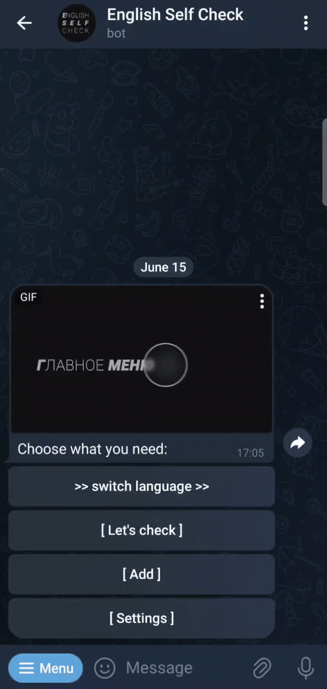

# English Self-Check Bot
### Telegram Bot for Self-Checking Learned Phrases


[README - Русский](README_RU.md)

## Description:

Telegram bot using aiogram for self-checking learned English phrases.

## Idea:

This bot is designed to work with your own memory, specifically for remembering English words, phrases, or expressions. The bot template can be adapted for any memory-related task. Add everything you want to remember and repeat later: revising learned material, fleeting impressions. One social function of this template could be an application for dementia prevention.





## How the Bot Works:

- You add any text in English, and then you will be prompted to enter the translation. You can also add phrases via voice message.
- There are two modes for checking: regular and spontaneous.
  - Regular mode: in the settings, you can select the time of day when the bot will periodically send phrases for checking every 20 minutes. Reply to this message with the translation of the phrase.
  - Spontaneous mode: by clicking the “Let's check” button, the bot starts sending you phrases one after another until you stop the check.
- In the settings, you can choose the phrases the bot will send: either only those you added or all yours together with the phrases pre-installed by the bot administrator.
- The bot features a user-friendly interface with an inline keyboard for easy navigation, including a language switch function.

## Main Commands:

- /start - start the bot
- /help - command instructions
- /add - add text phrase to the database
- /menu - activate the main menu
- /settings - activate the settings menu
- /list - request a list of phrases added by the user (sends an HTML file with a table of phrases and translations)
- /delete - delete a phrase

**Notes:**

- To add a phrase via voice message, you do not need to use the /add command. Any voice message will be interpreted by the bot as a request to add it.
- Any message that is not in spontaneous mode or a reply to a phrase in regular mode will be deleted to prevent clutter. If done correctly, the bot will always send a “Correct” or “Incorrect” message.

## Additional Information:

- The directory contains a database template example.db. Make a copy and rename it to database.db. The database is managed using sqlite3.
- User limit is 100 people. When using the /start command, the bot checks the current number of users.
- To stay within the limit of 30 requests per second, the bot module includes a user count check. As the number of users increases, the pause between requests increases.

## Dependencies:

- aiofiles==23.2.1
- aiogram==3.7.0
- aiohttp==3.9.5
- aiosignal==1.3.1
- annotated-types==0.7.0
- attrs==23.2.0
- certifi==2024.6.2
- frozenlist==1.4.1
- idna==3.7
- magic-filter==1.0.12
- multidict==6.0.5
- pydantic==2.7.4
- pydantic_core==2.18.4
- python-dotenv==1.0.1
- typing_extensions==4.12.2
- yarl==1.9.4

## Installation Instructions:

1. Clone the repository
2. Create a virtual environment in the project directory

```bash
python -m venv .venv
```

3. Install the required libraries

```bash
pip install aiogram python-dotenv
```

4. Create a .env file and set the environment variables

```visual
BOT_TOKEN=YOUR_TOKEN
ADMIN_ID=YOUR_ID
```

5. Make a copy of the database file `example.db` and rename it to `database.db`, ensuring the database file is also located in the `data/` directory.
6. Run the `bot.py` file.
7. To deploy the bot using systemd, use the example unit file english_check_bot.service:

```visual
[Unit]
Description=English_Self_Check_Bot
After=network.target

[Service]
EnvironmentFile=/etc/environment
ExecStart=/path/to/project/EnglishSelfCheckBot_demo/.venv/bin/python /path/to/project/EnglishSelfCheckBot_demo/bot.py
ExecReload=/path/to/project/EnglishSelfCheckBot_demo/.venv/bin/python /path/to/project/EnglishSelfCheckBot_demo/bot.py
WorkingDirectory=/path/to/project/EnglishSelfCheckBot_demo/
KillMode=process
Restart=always
RestartSec=5

[Install]
WantedBy=multi-user.target
```

8. Add the unit file to systemd and enable the service:

```bash
sudo systemctl enable english_check_bot.service
```` 

9. Start the service:

```bash
sudo systemctl start english_check_bot.service 
```
